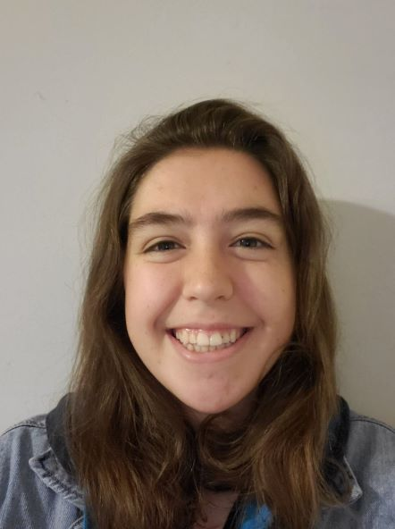
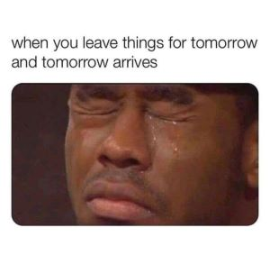

# Matilda Michel

> Fake it till you make it.

<p align="center">
  
   
</p>

## Table of Contents
- [Who am I as a Programmer?](https://mhm1117.github.io/CSE110/#who-am-i-as-a-programmer)
- [About Me](https://mhm1117.github.io/CSE110/#about-me)
- [Contact and Socials](https://mhm1117.github.io/CSE110/#contact-and-socials)

## Who am I as a Programmer?
I sort of have no idea what I'm doing. As of now, I'll admit I don't have really any experience in software engineering or developing. Most of my practical experience has to do with data science and supervised machine learning, so I do have some knowledge of planning, maintaining, and presenting a product/project. I'm very excited to get some of my first real-world-like software engineering experience.

I also am not sure I'll stick to the software engineering path. I'm very passionate about programming and like working on projects for class and on my own time, but I also am interested in data analysis or machine learning as a career. But these fields can work together, so I'm hoping I might see some overlap in whatever I decide to do.

Languages I'm Comfortable With:
1. C/C++
2. Python
3. Java

My goals for software engineering and this class:
- [x] Take CSE 110
- [ ] Learn JavaScript
- [ ] Learn what even goes into software engineering besides just coding
- [ ] Get more comfortable working with others on coding related projects
- [ ] Create a project I'm proud of
- [ ] Finish CSE 110

Me as a coder:
```
while(coding) {
  if(hungry)
    continue;
  if(haveOtherHWDueSooner)
    continue;
  if(phoneRinging)
    continue;
  if(haveToPee)
    continue;
  if(passingOutFromExhaustion)
    break;
}
nextTimeEvenLookingAtCode = "2 weeks from now";
```
## About Me
I'm from San Francisco and moved to SD for school in 2017! I'm a Cog Sci major specializing in Machine Learning and minoring in CSE. I never know how to phrase it, but i'm in my 3rd year as a transfer student, on my last quarter at UCSD. I'm looking for jobs in a few different fields to start next year and am hoping to find a job back home in SF.

**My Interests outside of school are...**
- Video Games (Ghost of Tsushima, Minecraft, Stardew Valley, and the Assassin's Creed games are some of my favorites!)
- Musical Theater (I think West Side Story and Into the Woods are my favorites, but it's hard to pick)

**I love...** Tea over coffee, swimming in the ocean, cats (especially mine!), going on little adventures, rollercoasters/theme parks, watching shows + video essays about those shows, and also mostly just staying at home all day.

**And one of my favorite memes...**



## Contact and Socials
**Email:** mmichel@ucsd.edu

**Discord:** mattiemay#5347

[Very Bare Linked-In](https://www.linkedin.com/in/matilda-michel-859751252/)

[Facebook](https://www.facebook.com/matilda.michel)
